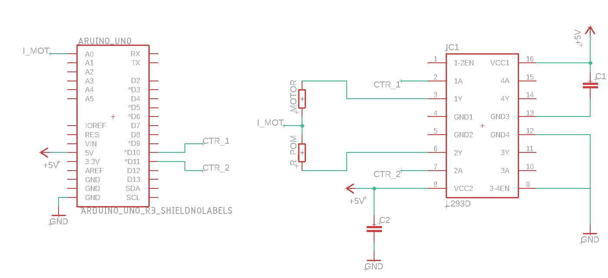

# Naped_DC-PV-SC

Układ sterowania napędu zasilanego z ogniwa PV wspomaganego ultra-kondensatorowym magazynem energii


## Add your files

```
>git clone https://gitlab.com/pbl-b-emob/naped_dc-pv-sc.git

>git add remote origin https://gitlab.com/pbl-b-emob/naped_dc-pv-sc.git

>cd [cloned_repo]

>git branch -M [branch_name]

>git commit -M "[txt of commit]"

>git push origin [branch_name]
```

## Modele PLECS

[](https://wutwaw-my.sharepoint.com/:f:/g/personal/01153009_pw_edu_pl/EtXvPZOxE1lCrET0B_qHf2kBk5IGChMz1utTAB-Jy4QKlA?e=LUxeyB)

## Hardware
- Arduino UNO
- Arduino LEONARDO

## Schemes
### DC Controll


## IDE
- VS Code 


### Install Extensions
- C/C++
- PlatformIO IDE

## PlatformIO - Manual
[Official tutorial](https://docs.platformio.org/en/stable/tutorials/index.html)

## PlatformIO - Quick Start

## Comands

Terminal > New Task or [Ctrl + Shift + P]
Choose:
- PlatformIO: Build <- To compile and build code
- PlatformIO: Upload <- To upload code to the board

## Add new code
- headers file (.h) -> include/
- functions code (.cpp) -> src/share/
- main code -> src/[project_name]/main.cpp

## Add new project
Add 
>in platformio.ini 
```
[env:[project_name]]
platform = atmelavr
board = [board_model]
framework = arduino
src_filter = -<*> +<[project_name]/> +<share/>
```

# Tests
To test correct working of program we will use program *scripts/ArduinoPlotter.py*
This programm allow to plot:
- speed_ref
- speed_sensor
- curr_ref
- curr_sensor
To test of Analog inputs, Comunication protocols and writing code.


Please visit code documentation 

[ArduinoPlotter documentation](Naped_DC_PV_SC/scripts/README.md)
---