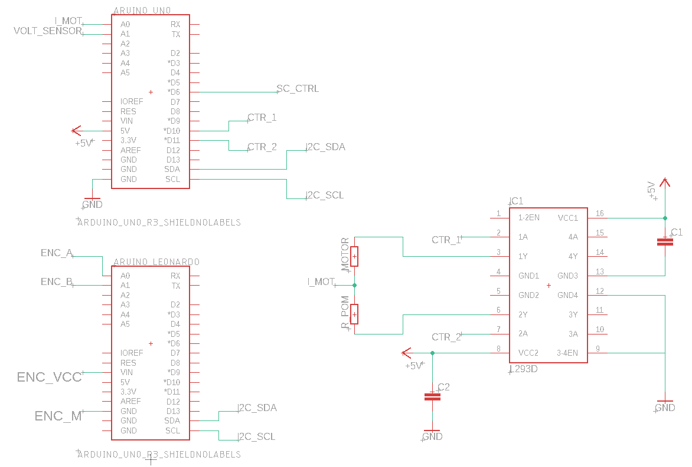

# Naped_DC-PV-SC

Drive control system powered by a PV cell supported by an ultra-capacitor energy storage


## Git quck quide

```
>git clone https://github.com/Damianoo00/Drive-DC-AC-SC.git

>cd [cloned_repo]

>git branch [new_branch_name]

>git checkout [new_branch_name]

>git commit -M "[txt of commit]"

>git push origin [new_branch_name]
```

## PLECS Simulations Models

[](https://wutwaw-my.sharepoint.com/:f:/g/personal/01153009_pw_edu_pl/EtXvPZOxE1lCrET0B_qHf2kBk5IGChMz1utTAB-Jy4QKlA?e=LUxeyB)

## Hardware
- Arduino UNO
- Arduino LEONARDO

## Scheme


## IDE
- VS Code 


### Install Extensions
- C/C++
- PlatformIO IDE

## PlatformIO - Manual
[Official tutorial](https://docs.platformio.org/en/stable/tutorials/index.html)

## PlatformIO - Quick Start

## Comands

Terminal > New Task or [Ctrl + Shift + P]
Choose:
- PlatformIO: Build <- To compile and build code
- PlatformIO: Upload <- To upload code to the board

## Add new code
- headers file (.h) -> *include/*
- functions code (.cpp) -> *src/share/*
- main code -> *src/[project_name]/main.cpp*

## Add new project
Add 
>in platformio.ini 
```
[env:[project_name]]
platform = atmelavr
board = [board_model]
framework = arduino
src_filter = -<*> +<[project_name]/> +<share/>
```

# MyProject Quick Start
1. Open *Drive-DC-AC-SC\Naped_DC_PV_SC* directory in VS Code
2. Clear *Drive-DC-AC-SC\Naped_DC_PV_SC/platformio.ini* by running Task (ctrl+alt+T -> Submodule: clear all)
3. Activate any submodule (ctrl+alt+T -> Submodule: ...)
4. Build project (ctr+alt+P -> PlatformIO: Build)
5. Upload project (ctrl+alt+P -> PlatformIO: Upload)
6. Test Program by Plotter (ctrl+alt+T -> Plotter: ...) 

# Scripts
There was also prepared some scripts to simplify:
- log
- plot logs
- use git submodules (starved repository)
- manage PlatformIO C++ compilation process

[Please read scripts documentation](Naped_DC_PV_SC/scripts/README.md)
---